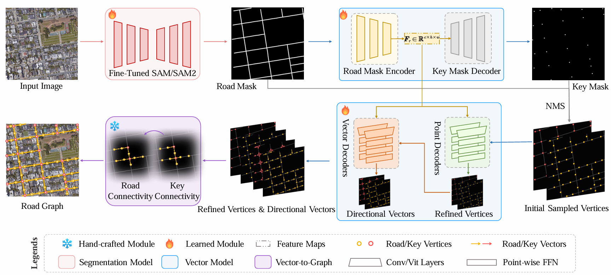
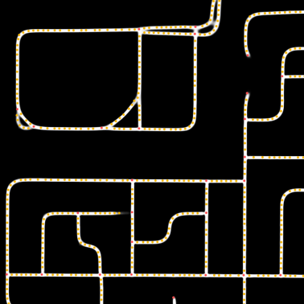
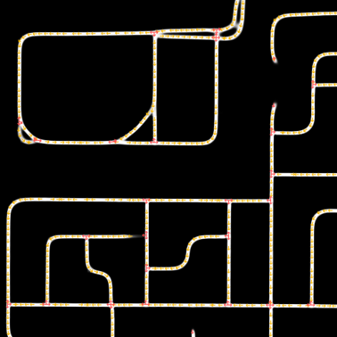
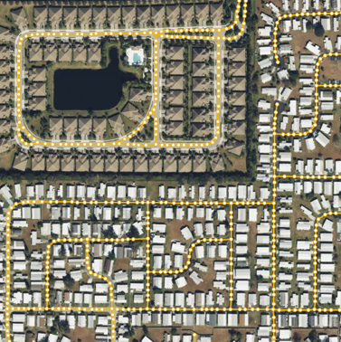
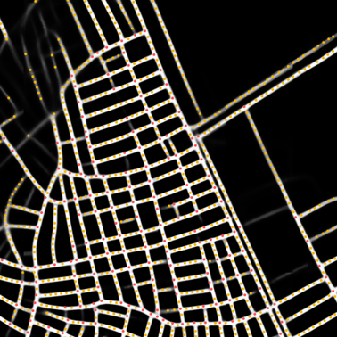
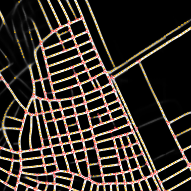
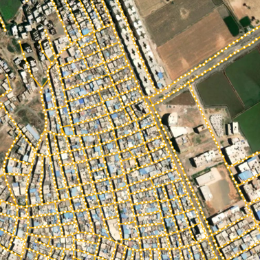

<div align="center">

# Seg2Vector: Remote Sensing Road Graph Extraction via Segmentation-to-Vector Transformation

</div>

<link rel="stylesheet" href="styles.css">

## Introduction

<div align="center">
  
</div>

## Visulization Demos

<table>
    <tr>
        <td></td>
        <td></td>
        <td></td>
    </tr>
    <tr>
        <td></td>
        <td></td>
        <td></td>
    </tr>
</table>

## Getting Started

### Environment

The basic environment requirements are:
- An NVIDIA GPU with the latest CUDA toolkit and driver.
- The latest version of PyTorch.
- Go, which is required only for the APLS metric.

Install the remaining Python packages:

```bash
pip install -r requirements.txt
```

Install SAM and SAM2 from their official repositories:

SAM: https://github.com/facebookresearch/segment-anything

SAM2: https://github.com/facebookresearch/sam2

```bash
cd segment-anything
python setup.py install
```

```bash
cd sam2
python setup.py install
```

### Dataset Preparation

Download the City-Scale, SpaceNet, and Global-Scale datasets and place them in any directory with a structure like this:

```text
/yourpath/
|-- cityscale/
|   |-- 20cities/
|   |-- data_split.json
|-- spacenet/
|   |-- RGB_1.0_meter/
|-- Global-Scale/
|   |-- train/
|   |-- val/
|   |-- in-domain-test/
|   |-- out_of_domain/
```

Dataset download links:

City-Scale and SpaceNet: https://cloud.tsinghua.edu.cn/d/d32cb7d4b19046ed9a42/

Global-Scale: https://pan.baidu.com/s/18HFMWV1VESFxZg25nCH4kw\?pwd\=fnku

### Pretrained Checkpoints Preparation

Place the pretrained checkpoints in the project root directory as follows:

```text
seg2vector/
|-- sam_ckpts/
|   |-- sam_vit_b_01ec64.pth
|   |-- sam2.1_hiera_base_plus.pt
|-- ...
```

Checkpoint download links:

SAM: https://dl.fbaipublicfiles.com/segment_anything/sam_vit_b_01ec64.pth

SAM2: https://dl.fbaipublicfiles.com/segment_anything_2/092824/sam2.1_hiera_base_plus.pt

## Training

The project supports both single-GPU and multi-GPU training. Example training scripts are provided in `shell/train`, and the corresponding configuration files are located in `Config`.

Before training, you need to:
- Set `dataset_dir` and `preprocess_dir` to the actual dataset paths in the configuration files.
- Set `is_preprocess = 1` in the configuration files if you are running the model for the first time and need to preprocess the dataset. Reset `is_preprocess = 0` if you run the model for the second time.  
- Update the data path and GPU settings in the training scripts.

### Example

If you want to train the SAM2 version on the City-Scale dataset, run:

```bash
bash shell/train/sam2_cityscale.py
```

## Inference and Evaluation

The project supports both single-GPU and multi-GPU inference, as well as multi-process evaluation. Example evaluation scripts are provided in `shell/eval`, and the corresponding configuration files are located in `Config`.

To initialize Go for the APLS metric, run:

```bash
go mod init apls
go mod tidy
```

Before evaluation, you also need to:
- Set `dataset_dir` to the actual dataset path in the configuration files.
- Update the data path, checkpoint path (using the default path for our provided checkpoints below), visualization path and GPU settings in the evaluation scripts.

### Example

If you want to evaluate the SAM2 version on the City-Scale dataset, run:

```bash
bash shell/eval/sam2_cityscale.py
```

We also provide our [trained checkpoints](https://github.com/ShqWW/seg2vector/releases/download/v0.0/work_dir.tar).

## Citation

```BibTeX
@inproceedings{he2020sat2graph,
  title={Sat2graph: Road graph extraction through graph-tensor encoding},
  author={He, Songtao and Bastani, Favyen and Jagwani, Satvat and Alizadeh, Mohammad and Balakrishnan, Hari and Chawla, Sanjay and Elshrif, Mohamed M and Madden, Samuel and Sadeghi, Mohammad Amin},
  booktitle={European Conference on Computer Vision},
  pages={51--67},
  year={2020},
  organization={Springer}
}

@inproceedings{hetang2024segment,
  title={Segment anything model for road network graph extraction},
  author={Hetang, Congrui and Xue, Haoru and Le, Cindy and Yue, Tianwei and Wang, Wenping and He, Yihui},
  booktitle={Proceedings of the IEEE/CVF Conference on Computer Vision and Pattern Recognition},
  pages={2556--2566},
  year={2024}
}

@inproceedings{yin2025towards,
  title={Towards satellite image road graph extraction: A global-scale dataset and a novel method},
  author={Yin, Pan and Li, Kaiyu and Cao, Xiangyong and Yao, Jing and Liu, Lei and Bai, Xueru and Zhou, Feng and Meng, Deyu},
  booktitle={Proceedings of the Computer Vision and Pattern Recognition Conference},
  pages={1527--1537},
  year={2025}
}
```
